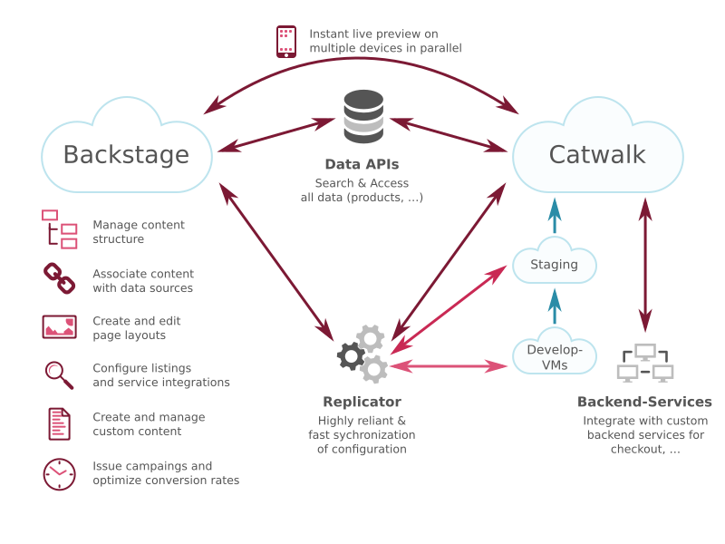
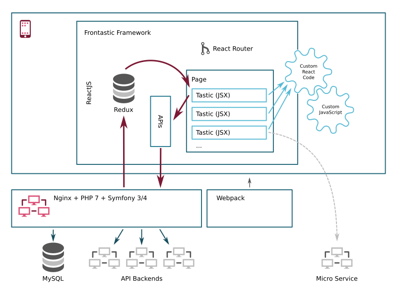

# Frontastic Architecture

Frontastic is a SAAS/PAAS service for agile, high-end (e-commerce) front-ends.

## High Level View

*Backstage* is the SAAS component of Frontastic. This is the back-end where
shop managers create and administrate their e-commerce experiences. For
developers Backstage offers facilities to upload Tastic specifications, custom
app specifications, monitor and profile their code in production and more.

The actual development work takes place in *Catwalk*. The Catwalk is an
independent application that ships customer experience to end-users: It serves
a single-page web-application based on HTML 5, CSS & JavaScript (mainly ReactJS).

Catwalk and Backstage are maintained as entirely decoupled applications which
both potentially access a common set of APIs.

### Data APIs

The code in Catwalk accesses Cloud APIs for data retrieval, data manipulation
and workflow (see center of the graphic above). For example, a Catwalk will
most probably interact with an commerce API like commercetools or ABOUT YOU
CLOUD. These APIs will provide product data and search facilities but also
basket and checkout management facilities to the Catwalk.

Frontastic abstracts access to these APIs behind a common API layer to ease
switching between different API provides, to allow developing of front-end
components that work against all supported back-ends and to encapsulate
authentication.

### Custom Backend Services

Developers can add very unique and custom functionality to a Catwalk, which is
not provided by the APIs supported by Frontastic itself: They can implement own
micro services for that purpose and access the APIs of these services right
away from the Catwalk JavaScript front-end.

Note that such services can, right now, not be hosted and supported by
Frontastic. However, since such micro services should be very slim and simple,
hosting them on any available Cloud Platform should be a possible with very few
effort. If you want to host such micro services, maybe take a look at
[Heroku](https://www.heroku.com/).

### Replicator

Frontastic itself only maintains the configuration data that is required to
serve a Catwalk. This includes:

- Pages and their structure ([Concepts: Nodes and
  Pages](concepts.md#nodes-and-pages))
- Tastic configuration ([Concepts: Tastic](concepts.md#tastic))
- API credentials and various shop configuration
- Small chunks of key-value data and minimal content snippet for pages

(In contrast, this does not include: product data, end-user personal
information, CMS content, and more.)

To keep each Catwalk an entirely independent application which is not affected
by performance or even downtime, data from Backstage to Catwalk is shipped
using a replication mechanism. This way every Catwalk only accesses its own,
dedicated database. Whenever data is changed in Backstage that affects a
certain Catwalk, the required information is synchronized downstream to the
catwalk.

The implemented replication algorithm is resilient, fast, consistent and
well-monitored so that even faults and outages in a Catwalk does not implicate
data consistency.

To you as a Catwalk developer this means that you can assume a stable
configuration data set at any time.

### Instant Preview

To allow instant preview of configuration changes to be stored in Backstage,
each Catwalk provides a dedicated API that is used to push configuration
previews and render a page on that basis. As a developer in Catwalk you do not
need to take care about this mechanism: To the JavaScript components the data
looks exactly the same as if they were provided from the replicated Catwalk
database.

## Catwalk Architecture

Catwalk consists of a slim back-end part that provides serving configuration and
API abstraction towards Frontastic supported cloud services. On top of that
resides the Catwalk front-end which is the place where Catwalk development
takes place.

### Front-end Framework

Frontastic gives you with a framework to serve progress web app single page
applications with very few effort. Still, we want to provide you with any
imaginable flexibility.

The framework is based on industry standard technology and components:

- The major code base is built using ReactJS for the smoothest user experience
  and easy component development
- React Router is used to switch between different parts of the application (we
  call the *Pages*) and to maintain application state like parameters and filters
- Redux is used to dispatch state changes throughout the application

The Framework manages which Page to show, connecting it with the required
configuration & data as well as rendering all page parts, the Tastics.

Tastics are standard ReactJS components which receive some special Props from
Frontastic. These props contain all configuration information (which originates
from Backstage) + the stream data provided by API back-ends. Behind this very
simple but powerful facade, which decouples Tastics from all the cumbersome
state management work, **you are free to program as you wish**.

We generally recommend to structure your code in well-designed ReactJS
components. These might again be Tastics so that shop managers you can
re-use smaller parts of application code as they need. We also recommend to
extract complex logic into independent, pure JavaScript classes which are
decoupled from ReactJS and HTML interaction. However, if you prefer to
structure your code differently, feel free to do so. 

### APIs and State

In order to communicate with the back-end services supported by Frontastic, we
provide you with an API abstraction that unifies access to all supported cloud
platforms. The APIs are available directly in JavaScript and their response
information is managed across Tastics using Redux.

In addition to that you are free to perform any HTTP access to your own or even
public (micro) services right away from JavaScript. You can also create and use
custom namespaces on the Redux store to manage state in a similar way.

### Back-end

The back-end that serves Catwalk is a very slim and fast application based on
Nginx, the newest PHP 7.x release and Symfony 3 (soon to be 4). As the Catwalk
data storage MySQL is used. Frontastic has chosen these long term established
solution stack due to its stability, scalability and fault resilience.

Beside this we use a highly modern Webpack 4 stack in combination with yarn to
manage JavaScript & JSX code as well as SCSS code and web assets.
