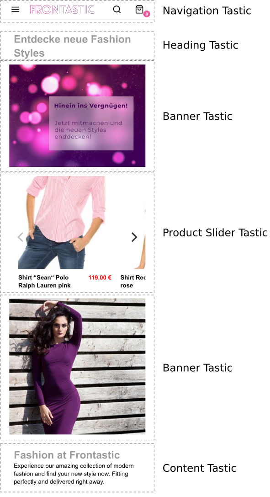

# Frontastic Concept Overview

This document gives an overview on technical concepts of a Frontastic catwalk.
You can read it from top to bottom to gain overall insights or just use it to
look up a specific concept. Advises for further reading are given in each
section.

## Catwalk (& Backstage)

"Catwalk" is the name of the front-end component of Frontastic that faces the
end-user. In contrast to that, "Backstage" is the back-end where shop managers
define pages, configure layouts and orchestrate APIs.

The purpose of a Catwalk is to provide the entire UI for the end-user, to
provide the JavaScript code for a shiny single-page-app experience and to
bridge all APIs used by the front-end.

A project might contain a single or multiple Catwalks which share code and
contain unique code. For example it might make sense to create a catwalk per
country: ``swiss``, ``us``, ``germany``. Or it could make sense to distinguish
target audiences like: ``teens``, ``babies``, ``mid-agers``. 

As a Frontastic developer, Catwalks are your base of working in and with. The
following sections explain the concepts you will be working with in scope of a
Catwalk.

Futher reading:

- @TODO: Directory structure of Catwalk
- [Architecture: Catwalk](architecture.md#catwalk-architecture)
- @TODO: Calling a Catwalk in the browser

## Tastic

A Tastic is a component that encapsulates visualization and logic for a
front-end puzzle piece in a re-usable way. Shop managers can orchestrate
Tastics to be displayed by a Catwalk on various pages in various combinations
through configuration in the Backstage.

The following graphic shows examples for Tastics:

As can be seen a Tastic can be very simple (e.g. just a headline) or rather
complex (e.g. a product slider). Furthermore, multiple instances of the same
Tastic with different configuration can be configured to occur on the same page
(e.g. 2 x banner Tastic, with different images and 1 x time with text 1 x time
without).

A Tastic contains:

- A schema definition (required)
- At least one ReactJS component (required) potentially more

The schema defines meta data about the Tastic and describes the configuration
parameters expected by the top most ReactJS component. The schema is not used
in Catwalk, but in Backstage to describe on a technical level how the Tastic
can be integrated. When Backstage configures a Tastic to be used on a certain
page, it will ensure that the require configuration is provided.

The single required ReactJS component is the entry point of the Tastic in
Catwalk. When a Tastic is configured by Backstage to be displayed on a page,
the entry component of the Tastic is included and receives all configuration
through ReactJS Props. Inside of the entry ReactJS component you can use as many
additional ReactJS components as you like, as well as any other JavaScript code
required to realize the Tastic.

Futher reading:

- [How to develop a Tastic](tutorials/10_simple_tastic.md)
- @TODO Directory structure of Catwalk
- @TODO Schemas

## Nodes and Pages

As a developer you are not directly concerned with the structure of Nodes and
Pages, but you can access and react to them.

Nodes give a tree structure to a Catwalk, similar to sitemaps. The tree is
configured by a shop-manager in the Backstage. It is typically reflected on the
navigation (Tastic). Nodes contain configuration, for example which streams are
available. Every URL that is displayed in catwalk is rendered on basis of a Node.

Every Node (in Backstage) can contain an arbitrary number of Pages while only a
single Page is active at a time and only the definition of this page is
available in Catwalk. To give some context: Shop-managers can draft pages
before they are made public and they can schedule times when certain pages
should be active.

The Page covers the entire layout visible in the Browser. Pages are therefore
structured in Regions & Cells which create a Layout (see below).

## Layouts, Cells, Regions (and Kits)

Each Page has an assigned Layout. The Layout defines the top-level structure of
the Page in terms of Regions. Examples for Region structures are: "header",
"main" & "footer" or "navigation" & "content".

A Cell is a responsive block where the shop-manager can decide if it spreads
full width, 1/2, 1/3 or 1/4. The Frontastic CSS framework takes care for
wrapping cells automatically. Each cell can contain any number of Tastics. So
this is where your work takes place: in a Tastic that resides in a Cell
(potentially together with other Tastics), which is part of a Region that is
part of a Layout.

Kits do not really matter from a Developer perspective. They are a concept of
grouping a number of Cells & Tastics as a re-usable block in Backstage. But
before being synchronized to Catwalk, the Kit wrapping is removed.

- @TODO: Graphic to illustrate Layout/Cell/Region/Kit

## Environments

Your Catwalk resides in an environment which changes when being viewed on
different systems. While you develop your code you test your Tastics in
*development*. To let a shop-manager test and preview your work you can move it
one level upwards to *staging*. *staging* is hosted on the Frontastic PAAS and
can therefore be viewed from the Internets. Once your work is ready to be
viewed by the outside world, you can promote your Tastic to *production*.

The promotion of Tastics is done in the Frontastic Backstage Developer App. The
workflow of promoting up on environments is also available for Custom Apps and
data of such.

## Stream

Streams are data provides for Tastics. The data provided by Stream originates
from an API request to a service that is supported by Frontastic. A Tastic can
require to retrieve a certain type of stream and can interact with it through
parameterization.

Example stream types are:

- a *Product List Stream* will contain an array of product objects
- a *Content Stream* will contain a content object
- a *Content Search Stream* will contain an array of content objects

A Tastic schema can include the requirement for any number of streams that a
Tastic requires. At run-time, the Tastic can assume the stream data is available.

To make Tastics work across different API providers, streams are abstracted on
the server side of the Catwalk. This allows you to re-use Tastics provided by
Frontastic for different projects.

## Custom App

A Custom App allows you to provide simple key-value data management facilities
to the shop-manager. You just implement a schema that is very similar to one
used for Tastics. Uploading this schema to Backstage provides listing and
editing facilities to the shop-manager and synchronizes this data to your
catwalk.

An example to illustrate this concept: Frontastic comes with a Custom App
called *Storefinder*.  With this, the shop-manager can manage point-of-sale
stores, their address, contact data and even local spokes persons per shop. In
the Catwalk you can now use this data to show users a map of shops, provide
contact links and such more.

Futher reading:

- @TODO Schemas
- @TODO Development of a Custom App

## Replication & Live Preview

Backstage is the SAAS part of the Frontastic solution. This is where all
shop-managers edit their data. Catwalks (the PAAS) are *entirely independent*
of this system:  Each Catwalk resides in its very own cloud infrastructure and
there is no direct communication link from Catwalk to Backstage. This allows
each Catwalk to scale independently, to have no performance and failure impact
from Backstage.

Still, data needs to be transferred between Backstage and Catwalk. This happens
through a component which we call Replicator. The component monitors changes
performed in Backstage and transmits these changes in correct order and a
failsafe manor to the Catwalk. Even if Backstage or Replicator fail the Catwalk
stays in tact and works as before. Also, if your Catwalk fails it will not
loose any updates because Replication will just continue after the last
successful change once the Catwalk is back up.

There is a second, very lightweight communication channel from Backstage to
Catwalk: The Live Preview. This channel transmits just a single
Node-Page-Combination to be instantly rendered by the Catwalk. As a developer
you do not need to take care about this functionality at all, because your
Tastic just resides in the normal environment of Node, Page, Region and Cell.

Further reading:

- [Architchture: Replicator](architecture.md#replicator)

## Misc

The following terms are not really important for development in Frontastic, but
you may stumble accross them while talking to shop-managers.

### Project

A customer instance in Backstage is called a Project. All of your Catwalks
belong to a Project. Catwalks in a Project can share code, data, both and any
mixture of that.

## Missing?

Do you miss an important concept in Frontastic to be explained here? Feel free
to hit me an email at toby@frontastic.cloud.
