# Testing a Tastic

!!! stability dependable

There are several stages how you should test your Tastic code. One of them is
of course by executing the code in the browser.

Because Tastics do not exist delicately on their own you need to prepare a
Page in Backstage which contains the Tastic. You only need to do that once for
every new Tastic, because the actual code for the Tastic exists on your VM and
is re-compiled on-the-fly whenever you change something.

However, creating pages to test your Tastics in different combinations and
layouts might also be a good idea later.

Once you create a [Tastic Specification](10_simple_tastic.md) you need to
upload the spec file to Backstage to make it know your Tastic exists. Log in to
Backstage at https://<your-project>.frontastic.io. 

## Uploading the Spec

Before doing anything else in Backstage you should ensure that you work in the
environment `development`:

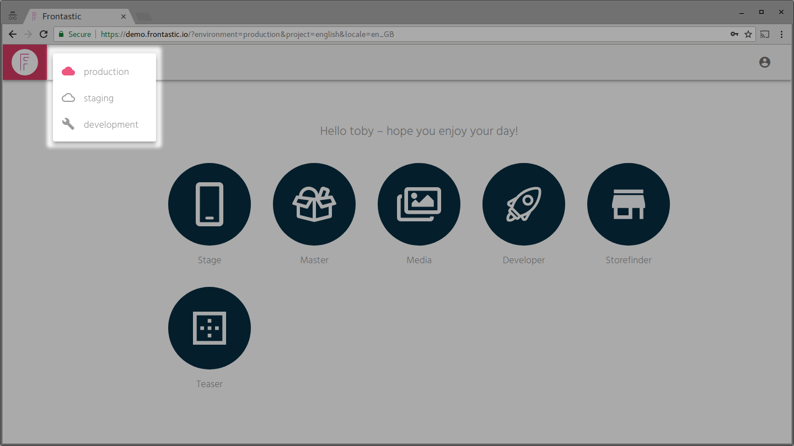

At the top left of the screen you see the environment selector. If this one
shows a *cloud* icon you are currently working in staging or even production.
So make sure you switch to the **wrench icon**.

Select the *Developer* app then …

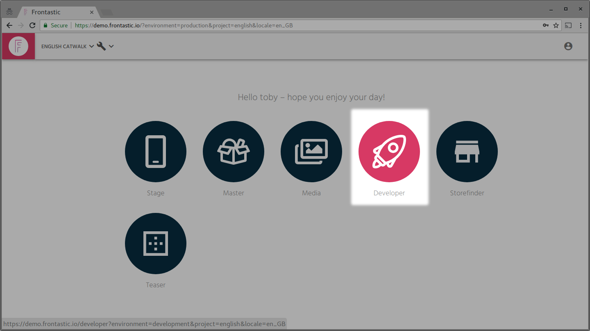

… and go to the *Tastics* section:

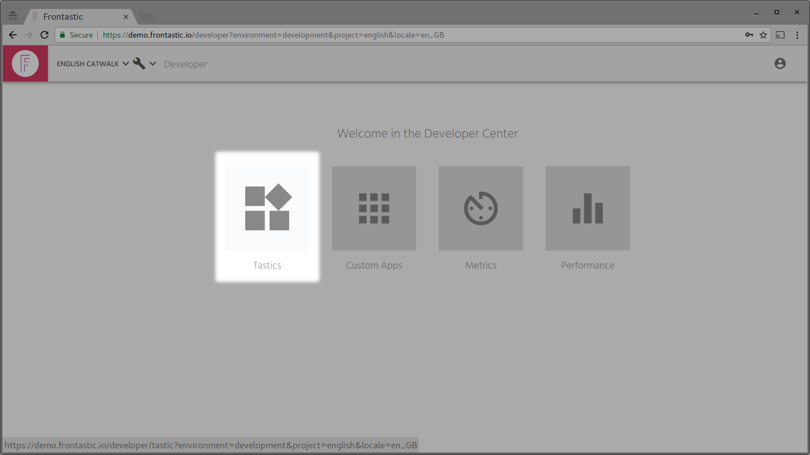

You see a list of all known Tastic specifications. Note that this list includes
all Tastics from environments "above" development(staging & production), too.

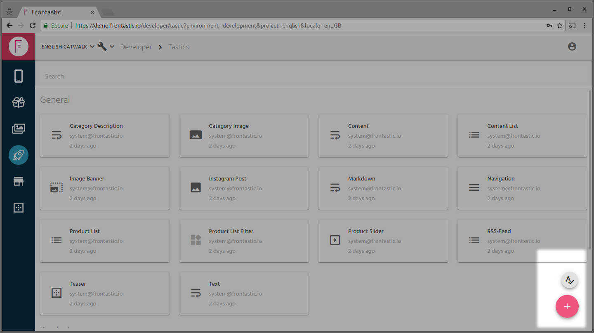

At the bottom right you can choose to upload your Tastic. If you want to make
sure the Tastic Spec is correct, first, use the button right above the primary
one.

When your Tastic spec is uploaded, Backstage knows that your Tastic exists and
which configuration it expects. You only need to repeat this step once the Spec
changes. Later, when you are satisfied with the implementation of your Tastic,
you can move it one environment level up to "staging" in order to let the show
manager review it.

## Creating a Node

Now switch to the *Stage* app where you will create a Node to configure your
Tastic.

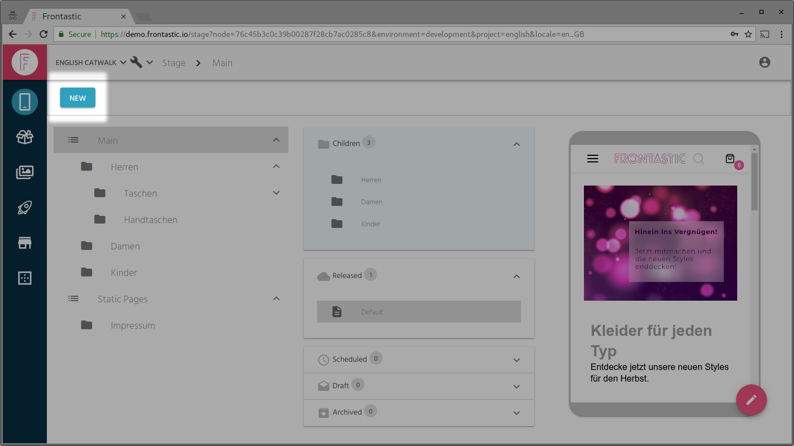

Since you are working in the "development" environment, the created Nodes will
not disturb shop managers working in "production". To keep some structure we
recommend to create a top-level node *Developer* where each developer can have
their own Node level, typically indicated by their name. This helps to avoid
disturbances between different developers:

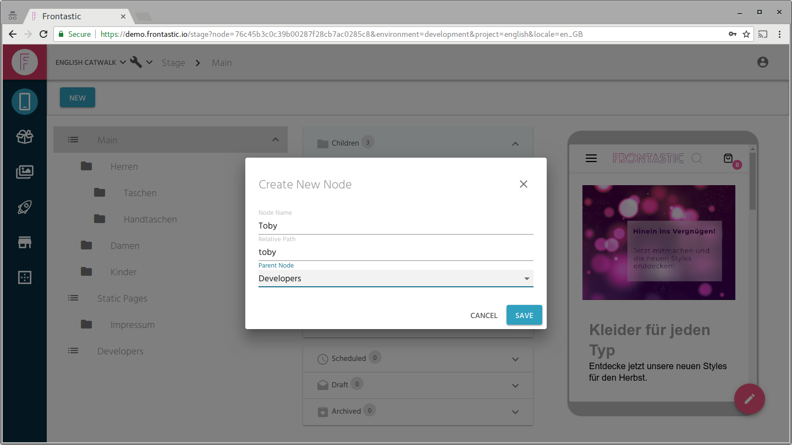

To create a Node, click *New* on the top right. After that you will be asked
for some basic Node settings. Nodes are nested in a tree structure as indicated
by the *Parent Node* field. You can envision them as folders that can contain
more Nodes and Pages.

Remember the path to your Node! You will need that path to view the Page
created later in your VM. For example: `/developers/toby`.

Many Tastics require a stream. For example the Product List Tastic that was
shown in [Implementing a Simple Tastic](10_simple_tastic.md) requires a Stream
of type `product-list`. Streams are created on Node level, because their data
can be shared between multiple Tastics on the same Page in that Node.

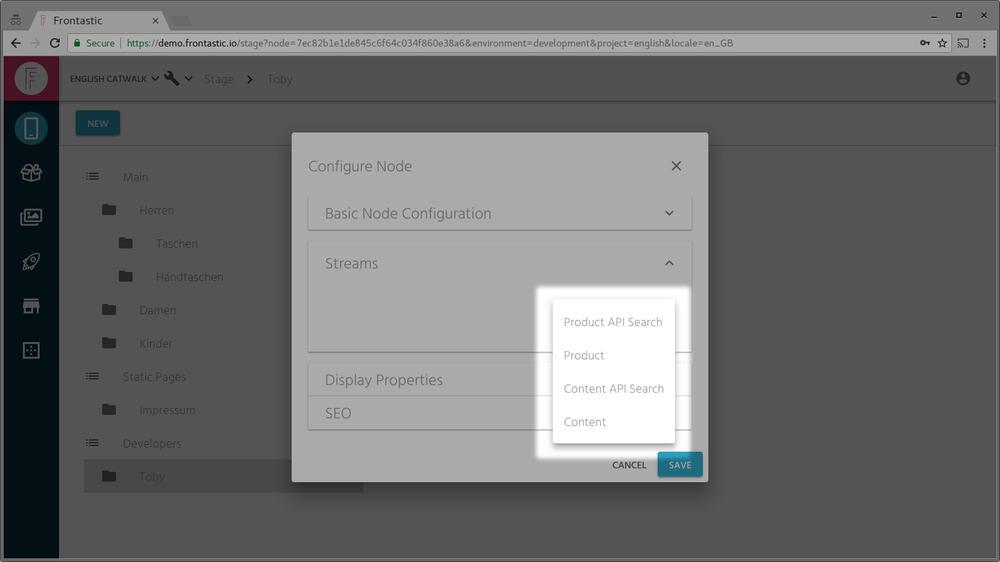

Select the *gear wheel* icon at your Node to edit its configuration. Switch to
the Streams section and add a new Stream. If you are working with the Product
List Tastic example, a *Product API Search* is the correct type.

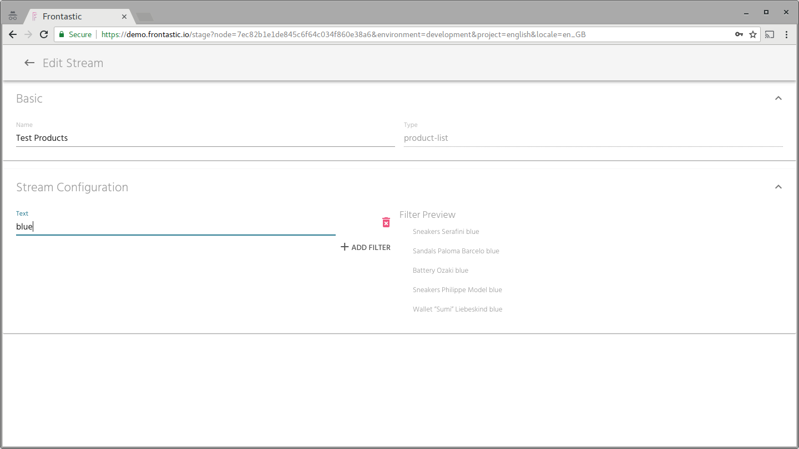

In the full screen dialog you can give your Stream a name and add any number of
filters to it. The *Filter Preview* gives you an idea of which products are
currently part of that Stream.

Go back and store the Node configuration.

## Create a Page

Finally you need a Page that contains your brand new Tastic. Select *New* again
but create a Page from a Layout now. Any layout should be fine, just pick one
that you like.

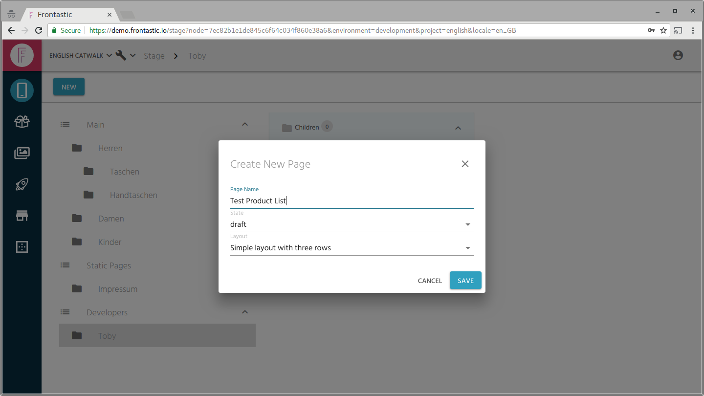

You can change the *State* of your Page to *production* directly, if you want.
Since we are in the *development* environment, that cannot hurt anyone. Once
you store the Page you find yourself in the *Page Editor*.

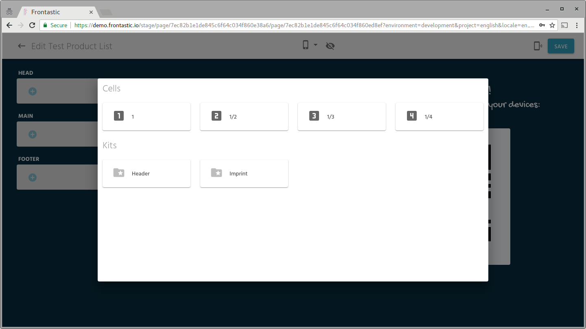

Select any of the Regions on your Page and add a Cell to it. This cell will
contain your Tastic.

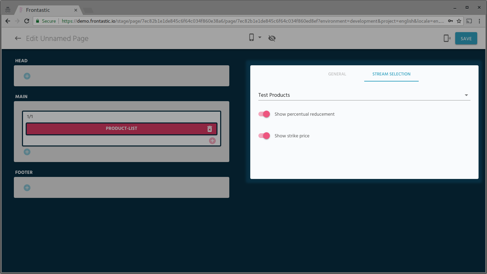

Using the *+* icon in the Cell allows you to add your Tastic. Clicking it opens
the Tastic configuration on the right. As you can see, it contains exactly
those options that you defined in your Tastic Spec. Select the options
accordingly and save the page.

Note: You cannot preview your Tastic in Backstage, yet. The code for the Tastic
only exists on your VM so far, so the preview environments cannot render it, yet.

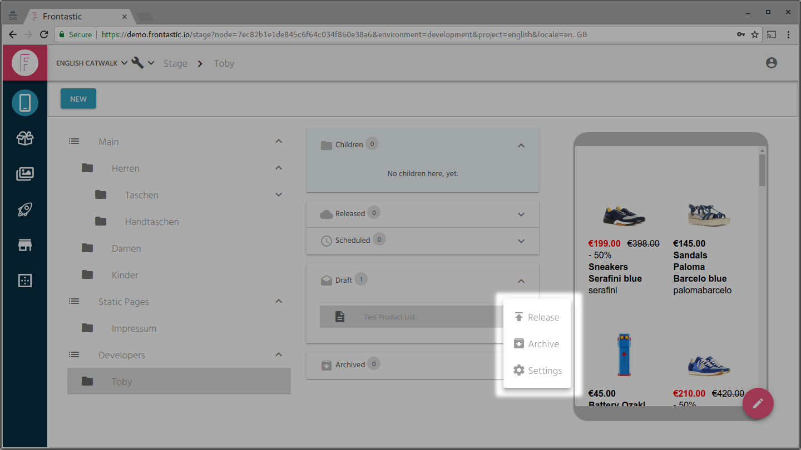

If you created your Page in *draft* mode, it's time now to release it. Click
the button right of the Page and select *Release*.

## Viewing the Tastic

Great, the pre-work is done. You can now view your Tastic in your VM. Just use
the URL path you specified at your Nodes against the local VM, e.g.
http://<catwalk>.frontastic.io.local/developers/toby.

Whenever you change the code of your Tastic, the development stack will
automatically re-compile the code and show you the result instantly. Enjoy!

**Note:** You do not need to process the steps shown in this tutorial for every
change to your Tastic. You only need to re-upload the Spec whenever it changes.

Besides that you are of course free to create more Nodes and Pages with your
Tastic to see it work in different configurations, setups and playing together
with other Tastics. These Nodes and Pages will also stay in tact when you
re-set your development VM. The [Replicator](../architecture.md#replicator) takes
care for that.
